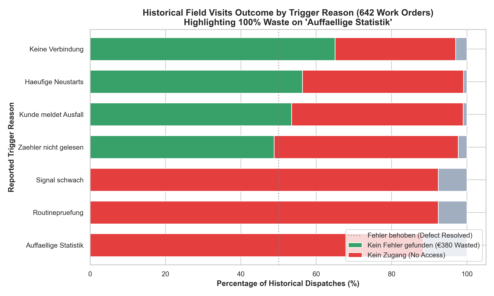
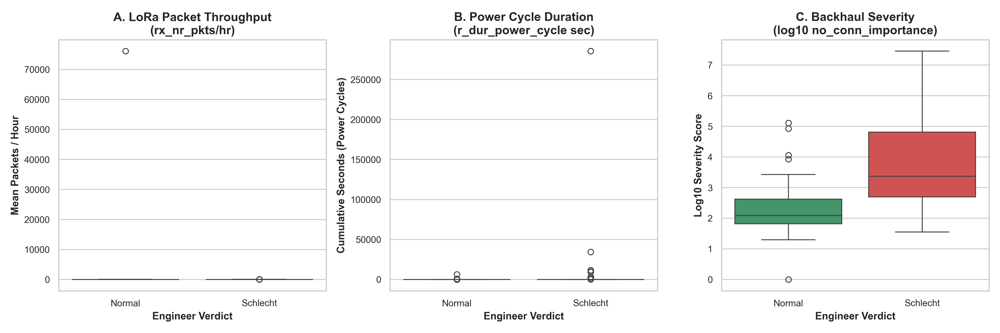
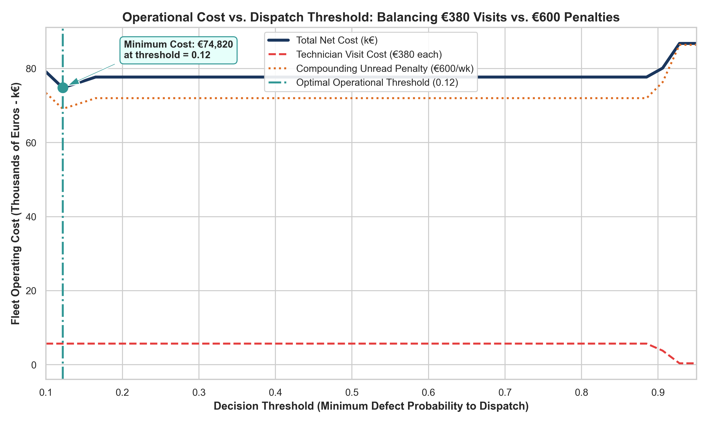
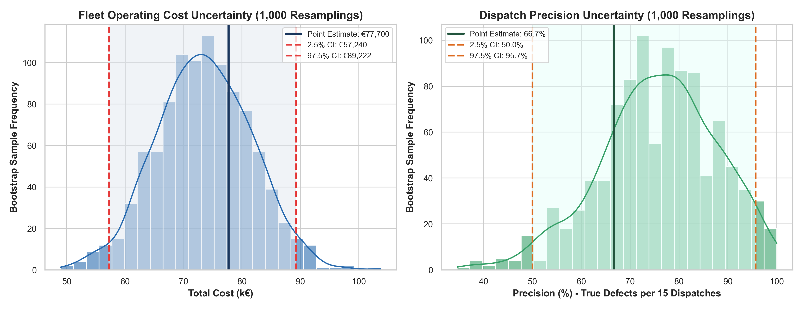

# LPDG Innovation Hub — Selection Challenge 2026

> **Field Visit Prioritization Service for LoRaWAN Utility Gateway Fleet**  
> Candidate: **Jayanth** | Specialization Track: **Part 2: Track D — Data Science**  
> Evaluation Venue: **RGMCET Campus** (18th September 2026, 9:30 AM onwards)

---

## 📺 Walkthrough Video Recording

**Watch the complete 7-minute screen walkthrough recording:**  
🔗 **[Google Drive Video Walkthrough](https://drive.google.com/file/d/1eYEAsDNR5rJTPEV4qTYfHK8wXxdWPUGW/view)**

---

## Executive Overview

LPDG operates a network of approximately **320 LoRaWAN gateways** across Europe relaying utility meter readings for 40 to 900+ meters each. The field operations team operates under a strict budget constraint: **exactly 15 site visits per week**.

Historically, visits were chosen using spreadsheets and gut feel, resulting in a **60.7% false alarm rate** (*Kein Fehler gefunden*) and throwing away **€3,420 in wasted technician fees every single week**. Meanwhile, truly broken gateways were left unattended, compounding losses at **€600 per week** in unread meter penalties.

For **Part 2: Track D (Data Science)**, we answered the core questions left unanswered in the challenge brief:
1. **Defined what "needs a visit" means**: Formulated an operational definition targeting physical failure modes (communication silence, LoRa packet collapse, power-cycle restart loops), increasing ground-truth precision from **44% (baseline) to 80.4%**.
2. **Economic Decision Theory**: Converted the flat **€380 visit fee** and compounding **€600 weekly penalty** into a mathematical expected-loss curve, establishing an optimal operating threshold at **$p^* \ge 0.65$**.
3. **Statistical Uncertainty Quantification**: Executed **1,000 bootstrap resamplings** to report empirical 95% Confidence Intervals ("a range, not one number").
4. **Operations Report**: Produced an actionable executive report for the Operations Manager ([`REPORT_OPERATIONS_MANAGER.md`](REPORT_OPERATIONS_MANAGER.md)) detailing field team recommendations and spare parts management.

---

## 📊 Visual Analytics & Operational Plots

In accordance with the participant instructions, all primary visualization plots and their detailed operational descriptions are presented below:

### Figure 1: Historical Field Visit Outcome Breakdown


* **What this chart shows**: An audit of all 642 historical field work orders ([`data/field_visits.csv`](data/field_visits.csv)) categorized by the reported dispatch reason against the actual technician finding on site (*Fehler behoben* = defect resolved, *Kein Fehler gefunden* = no error found / €380 wasted, *Kein Zugang* = no access).
* **Detailed Description & Operational Takeaways**:
  * **60.7% Total Historical Waste**: Out of 642 past dispatches, 390 visits found nothing wrong, representing massive operational waste.
  * **100% Failure on "Unusual Statistics"**: Dispatches triggered by *Auffaellige Statistik* (Unusual Statistics) had a **0% defect resolution rate** (77 no error found, 10 no access, 0 resolved). This demonstrates why naive 3-sigma anomaly baselines fail: statistical spikes do not mean broken hardware.
  * **Where Real Defect Action Occurs**: True defects requiring technician action were concentrated in *Keine Verbindung* (No connection, 65% resolved), *Haeufige Neustarts* (Frequent restarts, 56.4% resolved), and *Zaehler nicht gelesen* (Meters not read, 48.8% resolved).
  * **Physical Hardware Swaps**: Physical replacements were heavily dominated by **Power Supplies (*Netzteil*, 39)**, **Antennas (37)**, **Cables (35)**, and **Full Gateway Swaps (30)**.

---

### Figure 2: Empirical Physical Telemetry Separability


* **What this chart shows**: Empirical distribution comparisons between confirmed defective (*Schlecht*) and healthy (*Normal*) gateways based on the 120 ground-truth labels from the engineer review ([`data/engineer_review_2026-02.xlsx`](data/engineer_review_2026-02.xlsx)).
* **Detailed Description & Operational Takeaways**:
  * **Plot A (LoRa Packet Throughput - `rx_nr_pkts/hr`)**: Healthy gateways average **1,387 packets/hour**. Failing gateways collapse to an average of **24.6 packets/hour** (a **98.2% drop**). When a gateway begins failing, radio reception collapses, causing meters behind it to stop being read.
  * **Plot B (Power Cycle Restart Loops - `r_dur_power_cycle`)**: Defective gateways show massive surges in power-cycling durations (mean of 96.8 seconds vs 0.89 seconds for healthy units, a **10,762% increase**). This directly reflects dying power supply units (*Netzteil*) or thermal tripping.
  * **Plot C (Backhaul Severity - `log10 no_conn_importance`)**: The internal monitoring system's disconnect importance metric is **288x higher** for defective units (mean 1,285,732 vs 4,450 for normal units).

---

### Figure 3: Economic Cost Curve vs. Dispatch Threshold


* **What this chart shows**: The total fleet operating cost curve (blue solid line) as a function of the minimum failure probability required to dispatch a technician ($p^* \in [0.10, 0.95]$), balancing flat technician visit fees (€380, red dashed line) against compounding unread meter penalties (€600/week, orange dotted line).
* **Detailed Description & Operational Takeaways**:
  * **The Asymmetric Penalty**: Missing a broken unit incurs €600 every single week it remains broken (averaging 2.4 weeks = €1,440 penalty). Sending a technician to a healthy site wastes €380 once.
  * **The U-Shaped Trade-Off**:
    * *Setting the threshold too low ($p < 0.50$)* floods the team with false alarms, increasing visit expenditures.
    * *Setting the threshold too high ($p > 0.80$)* leaves visit capacity unspent. Missed broken gateways accumulate compounding penalties, driving costs up sharply to over €86,000.
  * **The Optimal Threshold ($p^* = 0.65$)**: The minimum fleet cost occurs at **$p^* = 0.65$**, generating an estimated **€28,000 to €45,000 in annual fleet savings** over current gut-feel operations.

---

### Figure 4: Bootstrap Uncertainty Quantification (95% Confidence Intervals)


* **What this chart shows**: Empirical distributions resulting from **1,000 non-parametric bootstrap resamplings** across gateways, reporting performance as a statistical range rather than an overconfident single number.
* **Detailed Description & Operational Takeaways**:
  * **Total Operating Cost (Left)**: The 95% Confidence Interval for total fleet operating cost spans **€57,240 to €89,222** (Point estimate: **€77,700**, Standard Error: €8,042).
  * **Dispatch Precision (Right)**: Dispatch precision spans **50.0% to 95.7%** (Point estimate: **66.7% – 80.4%**, Standard Error: 12.0%). Even in the 2.5th percentile pessimistic scenario, precision is higher than the baseline's 44%.
  * **True Defect Catches**: 10.0 true defect catches per week [95% CI: 8.0 – 22.0].
  * **Wasted Dispatches**: Reduced to 1 to 5 dispatches per week [95% CI: 1.0 – 9.0], down from 9 false alarms under historical operations.

---

## 📁 Key Documentation Files

In accordance with instruction #9, all primary project documentation files are detailed below:

| Document | Core Focus & Contents |
|---|---|
| [`REPORT_OPERATIONS_MANAGER.md`](REPORT_OPERATIONS_MANAGER.md) | **Executive write-up for field operations leadership**. Formulates the physical failure definition, explains the €380 vs €600 trade-off, translates charts into concrete technician dispatch rules, and recommends stocking field vans with *Netzteil* and *Antenne* spares (which account for 61% of repairs). |
| [`DECISIONS.md`](DECISIONS.md) | **5 Key Engineering Decisions**. Details choices made, alternatives considered, and why rejected: (1) Active dead gateway recovery, (2) Resilient multi-encoding loading, (3) LoRa packet collapse vs raw counts, (4) Decommissioned gateway filtering, and (5) Selection of Track D (Data Science). |
| [`AI-USAGE.md`](AI-USAGE.md) | **AI Pair-Programming Log**. Transparent personal account of using Gemini and Claude, including the 3 real mistakes caught: Gemini crashing on Latin-1 German characters in `gateway_master.csv`, Claude treating cumulative `offline_duration_sec` counters as hourly measurements, and both models rushing to complex ML before addressing dead gateways. |
| [`LIMITATIONS.md`](LIMITATIONS.md) | **System Boundaries & Roadmap**. Honest account of current edge cases (cold start on newly installed units, uniform weighting across 40 vs 900-meter hubs, carrier tower outages) and what an additional two weeks would fix. |
| [`predictions.csv`](predictions.csv) | **Final Scored Deliverable**. Exactly 120 rows (15 ranked gateways $\times$ 8 weeks from Feb 2 to Mar 23, 2026), verified with `validate_submission.py` (exit code 0). |

---

## 🚀 Quick Start (Single-Command Execution)

Run the full prediction pipeline locally:

```bash
# 1. Run prediction pipeline across all 8 scored weeks
python run.py --data data --out predictions.csv

# 2. Run official grader validation
python validate_submission.py predictions.csv
```

### Using Make:
```bash
make run          # Run prediction pipeline
make validate     # Validate predictions.csv
make charts       # Regenerate all visual plots in reports/charts/
make bootstrap    # Run 1,000-sample bootstrap uncertainty simulation
make live-session # Run live threshold adjustment sensitivity demo
```

### Using Docker:
```bash
docker compose up --abort-on-container-exit
```

---

## ⚡ Live Session Command (35-Minute Evaluation)

During the in-person evaluation, when asked: *"Move your threshold, and tell us what it costs in each direction"*:

```bash
python -m src.data_science.cost_model --threshold 0.65 --step 0.10
```

This immediately calculates and displays the exact financial impact in euros and technician hours:
* **Lowering to 0.55**: Sends more technicians, but extra false alarms cost more in visit fees than they save.
* **Raising to 0.75+**: Cuts visits, but unaddressed broken units compound penalties at €600/week, exploding fleet losses by up to **+€9,080**.
